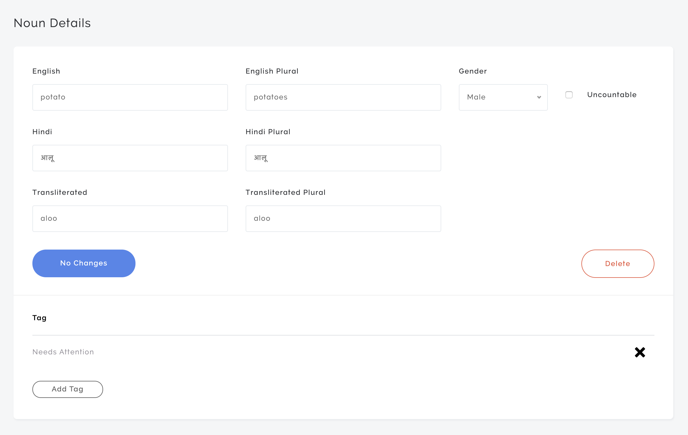
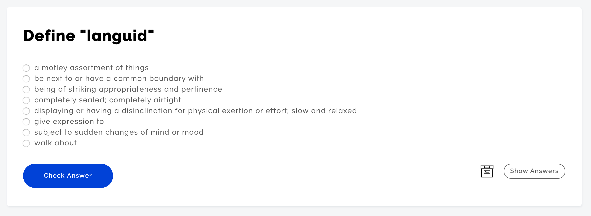

# Flash Cards

I like learning new languages but I'm not particularly good at it. I've used both Rosetta Stone and Duolingo, but have found that their multiple choice questions don't result in me remembering the proper grammar in real world situations.

I decided to try my hand at writing an app that would allow me to practice Hindi by forcing me to write the correct translations to English sentences without the help of multiple choice answers. Later, I added Spanish as well.

## Creating Nouns, Verbs, and Adjectives

It is the users responsibility to populate the database with nouns, verbs, and adjectives that the app can then use to create sentences. This was accomplished using conventional Rails CRUD models, controllers, and views.

## Tags

Words can be assigned tags. For example, you may want to tag a word as "Needs Attention".

## Creating Quizzes

Quizzes are created by selecting different kinds of questions. If desired, questions can be associated with a tag to limit the potential pool of words chosen for that question.

## Running Quizzes

You will be given a quiz with the questions you selected.

Hindi sentences can be written in Devanagari or in transliterated Roman letters.

It has Spanish questions too!

You'll get your score (and a list of questions you got wrong) at the end of the quiz.

## Other Subjects

You can also use this app to create quizzes on subjects other than languages. One question type is simply called `Card`, which lets you fill in whatever question you want.

You can insert an image into the question if desired.

For longer answers, such as a word definition, you can make cards multiple choice.

